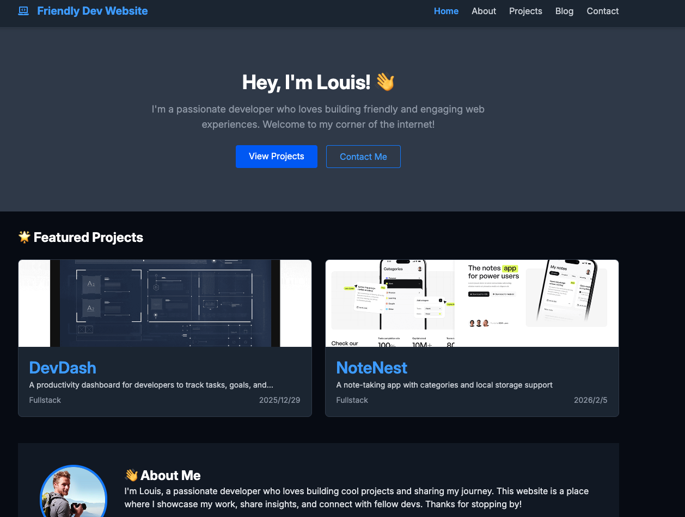

# Friendly Dev - Portfolio Website



A portfolio website aimed at web developers, featuring project showcases and a blog. This project is built for learning purposes, exploring modern web development technologies.

**[Live Demo](https://friendly-dev-website-frontend.vercel.app/)**

> **⚠️ Performance Notice:** The backend is hosted on the free tier of Render.com. If the service has been inactive, please allow **50 seconds or more** for the initial request to complete due to the instance cold start.

## 🛠 Tech Stack

* **Frontend:** [React Router v7](https://reactrouter.com/) (Framework Mode, SSR), React 19, Tailwind CSS
* **CMS:** [Strapi](https://strapi.io/) (Headless CMS)
* **Database:** PostgreSQL (via [Neon](https://neon.tech/))
* **Media:** [Cloudinary](https://cloudinary.com/) (Image management)
* **Deployment:** Vercel (Frontend), Render (Backend)

## ✨ Key Features

* **Projects & Blog:** Showcases projects and blog posts with filtering, sorting, and reusable pagination.
* **Responsive Design:** Fully responsive layout including a mobile-friendly hamburger menu.
* **Contact Form:** Integrated with Formcarry.
* **Architecture:**
  * **React Router Framework Mode:** A key learning highlight. The project implements React Router v7 in framework mode to leverage advanced features like data loading and actions, shifting away from the traditional declarative routing approach.
  * Transitioned from local JSON/Markdown (using `json-server`) to a full Headless CMS (Strapi) architecture.

## 🚀 Getting Started

### Prerequisites

* Node.js
* pnpm (recommended)

### Installation

```bash
pnpm install
```

### Configuration

Create a `.env` file in the root directory with the following variables:

```env
VITE_API_URL=http://localhost:20001
VITE_STRAPI_URL=http://localhost:1337
VITE_FORM_SUBMISSION_URL=your_formcarry_endpoint
```

### Scripts

* `pnpm dev` - Start the development server.
* `pnpm build` - Build for production.
* `pnpm start` - Start the production server.
* `pnpm json-server` - (Deprecated) Run the local JSON server. Used for early development before Strapi integration.
